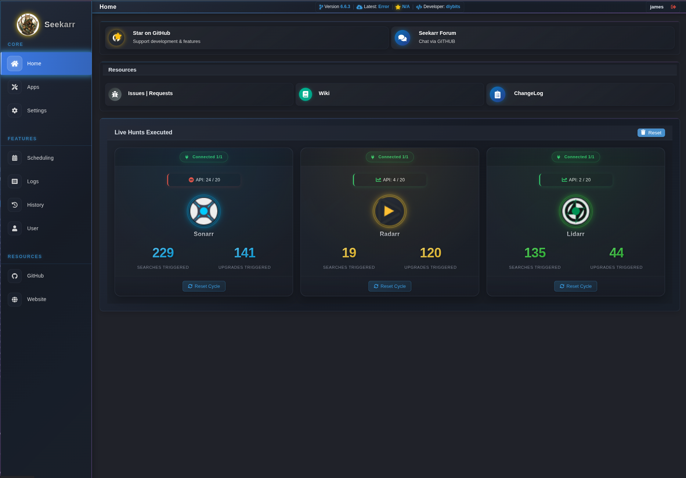
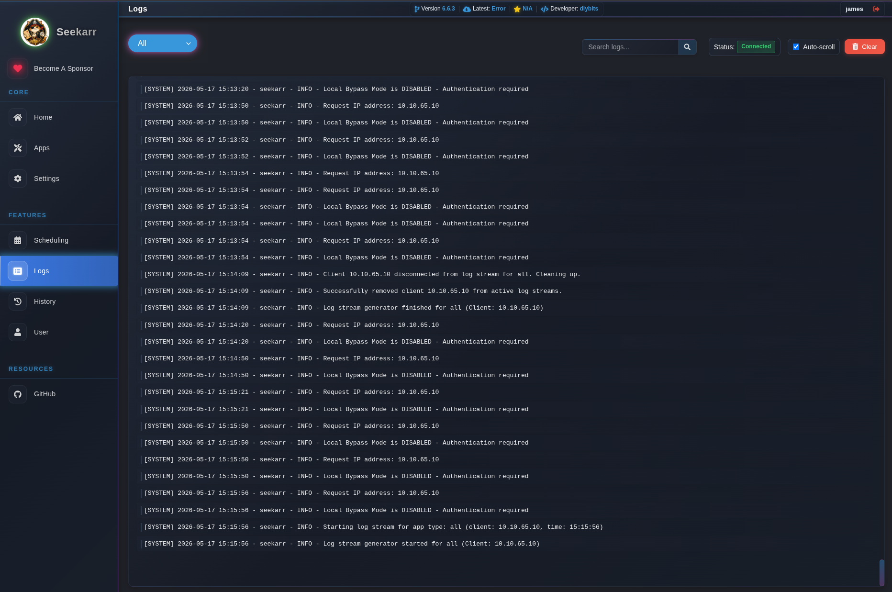
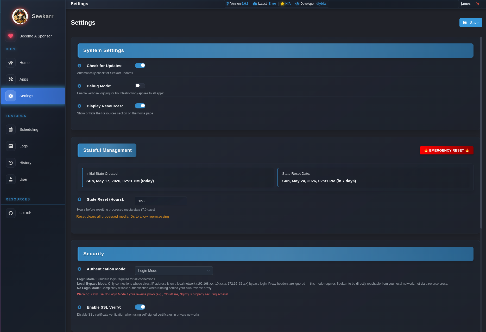

<h2 align="center">Seekarr - Find Missing & Upgrade Media Items</h2> 

<p align="center">
  
</p>

---

<h2 align="center">Want to Help? Click the Star in the Upper-Right Corner! ⭐</h2> 

| Application | Status        |
| :---------- | :------------ |
| Sonarr      | **✅ Ready**  |
| Radarr      | **✅ Ready**  |
| Lidarr      | **✅ Ready**  |
| Readarr     | **✅ Ready**  |
| Whisparr v2 | **✅ Ready**  |
| Whisparr v3 | **✅ Ready**  |
| Bazarr    | **❌ Not Ready** | 


Keep in mind this is very early in program development. If you have a very special hand picked collection (because some users are extra special), test before you deploy.

## Table of Contents
- [Overview](#overview)
- [How It Works](#how-it-works)
- [Web Interface](#web-interface)
  - [How to Access](#how-to-access)
  - [Web UI Settings](#web-ui-settings)
  - [Volume Mapping](#volume-mapping)
- [Installation Methods](#installation-methods)
  - [Docker Run](#docker-run)
  - [Docker Compose](#docker-compose)
  - [Unraid Users](#unraid-users)
- [Tips](#tips)
- [Troubleshooting](#troubleshooting)
- [Change Log](#change-log)
- [Security](#security)

## Overview

This application continually searches your media libraries for missing content and items that need quality upgrades. It automatically triggers searches for both missing items and those below your quality cutoff. It's designed to run continuously while being gentle on your indexers, helping you gradually complete your media collection with the best available quality.

For detailed documentation, please visit our [Wiki](https://github.com/diybits/seekarr/wiki).

## How It Works

### 🔄 Continuous Automation Cycle

#### 1️⃣ Connect & Analyze
🔌 Seekarr connects to your Sonarr/Radarr/Lidarr/Readarr/Whisparr/Eros instances and analyzes your media libraries to identify both missing content and potential quality upgrades.

#### 2️⃣ Hunt Missing Content
- 🔍 **Efficient Refreshing:** Skip metadata refresh to reduce disk I/O and database load
- 🔮 **Future-Aware:** Automatically skip content with future release dates
- 🎯 **Precise Control:** Configure exactly how many items to process per cycle
- 👀 **Monitored Only:** Focus only on content you've marked as monitored

#### 3️⃣ Hunt Quality Upgrades
- ⬆️ **Quality Improvement:** Find content below your quality cutoff settings
- 📦 **Batch Processing:** Set specific numbers of upgrades to process per cycle
- 🚦 **Queue Management:** Automatically pauses when download queue exceeds your threshold
- ⏱️ **Command Monitoring:** Waits for commands to complete with consistent timeouts

#### 4️⃣ API Management
- 🛡️ **Rate Protection:** Hourly caps prevent overloading your indexers
- ⏲️ **Universal Timeouts:** Consistent API timeouts (120s) across all applications
- 🔄 **Consistent Headers:** Identifies as Seekarr to all Arr applications
- 📊 **Intelligent Monitoring:** Visual indicators show API usage limits

#### 5️⃣ Repeat & Rest
💤 Seekarr waits for your configured interval (adjustable in settings) before starting the next cycle, ensuring your indexers aren't overloaded while maintaining continuous improvement of your library.

## Web Interface

Seekarr's live homepage will provide you statics about how many hunts have been pursed regarding missing media and upgrade searches! Note: Numbers reflected are but all required for testing. 

<p align="center">
  
  <br>
  <em>Homepage</em>
</p>

Seekarr includes a real-time log viewer and settings management web interface that allows you to monitor and configure its operation directly from your browser.

<p align="center">
  
  <br>
  <em>Logger UI</em>
</p>

### How to Access

The web interface is available on port 9705. Simply navigate to:

```
http://YOUR_SERVER_IP:9705
```

The URL will be displayed in the logs when Seekarr starts, using the same hostname you configured for your API_URL.

### Web UI Settings

The web interface allows you to configure all of Seekarr's settings:

<p align="center">
  
  <br>
  <em>Settings UI</em>
</p>

### Volume Mapping

To ensure data persistence, make sure you map the `/config` directory to a persistent volume on your host system:

```bash
-v /your-path/appdata/seekarr:/config
```

---

## Installation Methods

### Docker Run

The simplest way to run Seekarr is via Docker (all configuration is done via the web UI):

```bash
docker run -d --name seekarr \
  --restart always \
  -p 9705:9705 \
  -v /your-path/seekarr:/config \
  -e TZ=America/New_York \
  ghcr.io/diybits/seekarr:latest
```

To check on the status of the program, you can use the web interface at http://YOUR_SERVER_IP:9705 or check the logs with:
```bash
docker logs seekarr
```

### Docker Compose

For those who prefer Docker Compose, add this to your `docker-compose.yml` file:

```yaml
services:
  seekarr:
    image: ghcr.io/diybits/seekarr:latest
    container_name: seekarr
    restart: always
    ports:
      - "9705:9705"
    volumes:
      - /your-path/seekarr:/config
    environment:
      - TZ=America/New_York
```

Then run:

```bash
docker-compose up -d seekarr
```

### Unraid Users

You can install Seekarr using the Unraid App Store.

If not, you can run this from Command Line in Unraid:

```bash
docker run -d --name seekarr \
  --restart always \
  -p 9705:9705 \
  -v /mnt/user/appdata/seekarr:/config \
  -e TZ=America/New_York \
  ghcr.io/diybits/seekarr:latest
```

## Tips

- **First-Time Setup**: Navigate to the web interface after installation to create your admin account with 2FA option
- **API Connections**: Configure connections to your *Arr applications through the dedicated settings pages
- **Search Frequency**: Adjust Sleep Duration (default: 900 seconds) based on your indexer's rate limits
- **Batch Processing**: Set Hunt Missing and Upgrade values to control how many items are processed per cycle
- **Queue Management**: Use Minimum Download Queue Size to pause searching when downloads are backed up
- **Skip Processing**: Enable Skip Series/Movie/Artist Refresh to significantly reduce disk I/O and database load
- **Future Content**: Keep Skip Future Items enabled to avoid searching for unreleased content
- **Authentication**: Enable two-factor authentication for additional security on your Seekarr instance
- **API Rate Limits**: Configure hourly API caps to prevent rate limiting by your indexers
- **Universal Timeouts**: All apps use consistent 120s timeouts for reliable command completion
- **Monitored Only**: Filter searches to focus only on content you've marked as monitored

## Troubleshooting

- **API Connection Issues**: Verify your API key and URL in the Settings page (check for missing http:// or https://)
- **Config URLs**: It is best practice to omit the trailing slash (/) at the end of the URL for each service. For Sonarr, use http://10.10.10.1:8989 instead of http://10.10.10.1:8989/
- **Authentication Problems**: If you forget your password, delete `/config/user/credentials.json` and restart
- **Two-Factor Authentication**: If locked out of 2FA, remove credentials file to reset your account
- **Web Interface Not Loading**: Confirm port 9705 is correctly mapped and not blocked by firewalls
- **Logs Not Showing**: Check permissions on the `/config/logs/` directory inside your container
- **Missing State Data**: State files in `/config/stateful/` track processed items; verify permissions
- **Docker Volume Issues**: Ensure your volume mount for `/config` has correct permissions and ownership
- **Command Timeouts**: Default values are now command_wait_delay=1s and command_wait_attempts=600
- **Debug Information**: Enable Debug Mode temporarily to see detailed API responses in the logs
- **API Timeout Errors**: All apps now use universal timeout settings (120s) from general.json
- **Consistent Log Filtering**: If app-specific logs show mixed content, reduce historical data from 5KB to 1KB
- **Swaparr Issues**: Ensure proper handling of non-dictionary records in queue data
- **App-Specific Problems**: Check GitHub Issues for known problems and solutions
- **Session Errors After Migration**: If you move your `/config` volume and sessions stop working, delete `/config/secret_key` and restart — a new key will be generated (all existing sessions will be invalidated)

## Security

- **Session Secret Key**: Seekarr automatically generates a unique, cryptographically random session key on first start and stores it at `/config/secret_key` (readable only by the process owner). No action is required. If you prefer to supply your own key, set the `SECRET_KEY` environment variable — it takes precedence over the auto-generated file.
- **Two-Factor Authentication**: Enable TOTP-based 2FA in the user profile settings for an additional layer of protection.
- **Authentication Modes**: Three modes are available — standard login, local-network bypass, and no-login mode. Local-network bypass and no-login mode are intended for trusted private networks only.
- **Local Network Bypass**: When local-network bypass mode is enabled, authentication is skipped only for requests whose TCP source address (`remote_addr`) falls within a private IP range. Proxy headers such as `X-Forwarded-For` are intentionally ignored for this check and cannot be used to spoof a local address. This mode requires Seekarr to be directly reachable on your local network — do not use it when Seekarr sits behind a reverse proxy; use No Login Mode instead.
- **Reverse Proxy**: When running behind Nginx, Traefik, Caddy, or any other reverse proxy, set the `TRUST_PROXY=1` environment variable. This enables Werkzeug's `ProxyFix` so that `X-Forwarded-For`, `X-Forwarded-Proto`, and `X-Forwarded-Host` headers are trusted, real client IPs are visible to the local-bypass check, and the session cookie receives the `Secure` flag. Do **not** set `TRUST_PROXY=1` on deployments that are directly internet-facing, as it would allow clients to spoof their IP address.
- **Stats Reset**: The `/api/stats/reset` endpoint requires an authenticated session. The former unauthenticated `/api/stats/reset_public` endpoint has been removed — if you were calling it directly, switch to `/api/stats/reset` with a valid session cookie.
- **Password Storage**: Passwords are hashed with bcrypt, a purpose-built algorithm with a tunable cost factor that makes brute-force attacks computationally expensive. Existing accounts are migrated to bcrypt automatically on next login — no action required.

## Change Log
See [CHANGELOG.md](CHANGELOG.md) for a detailed history of security fixes and breaking changes.

For full release notes visit: https://github.com/diybits/seekarr/releases/
